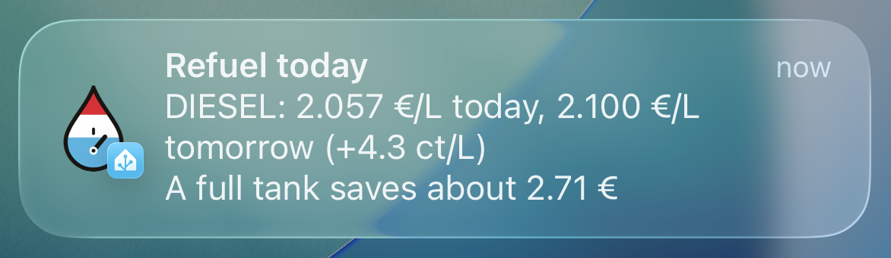
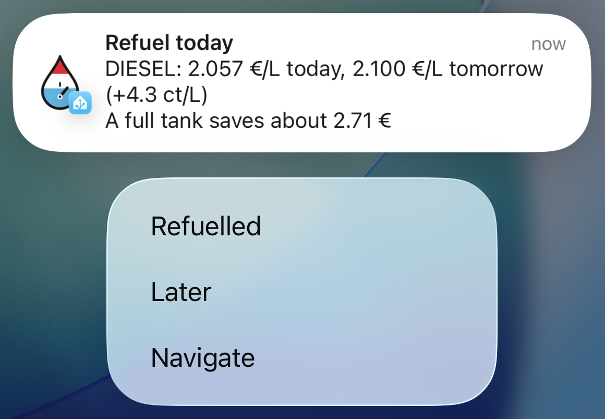

# LëtzFuel HA Blueprint

[](https://github.com/dabo53ck/letzfuel-ha-blueprint/releases)
[](https://github.com/dabo53ck/letzfuel-ha-blueprint/actions/workflows/validate.yml)
[](https://github.com/dabo53ck/letzfuel-ha-blueprint/actions/workflows/tests.yml)

A Home Assistant blueprint for the
[LëtzFuel HA](https://github.com/dabo53ck/letzfuel-ha-luxembourg-fuel-monitor)
integration. It adds what the integration's own notifications don't do:

- **Refuel reminder**: while the recommendation is "Refuel today", a reminder
  when it matters (leaving a place, the car starting to move, set times),
  with the buttons *Refuelled*, *Later* and *Navigate*.
- **Own actions** on the integration's events: Telegram, a script, a light,
  anything an automation can do.

> [!TIP]
> For the standard phone notifications (price announced, new price in effect,
> refuel recommendation, live countdown, price threshold) use the integration
> itself: Settings → Devices and services → LëtzFuel HA → **Add recipient**.

- [Requirements](#requirements)
- [Install](#install)
- [Refuel reminder](#refuel-reminder)
- [Navigate button](#navigate-button)
- [Own actions](#own-actions)
- [Language](#language)
- [Troubleshooting](#troubleshooting)
- [Versioning](#versioning)
- [Issues](#issues)
- [License](#license)

---

## Requirements

- Home Assistant **2026.7** or newer.
- [LëtzFuel HA](https://github.com/dabo53ck/letzfuel-ha-luxembourg-fuel-monitor)
  **0.1.1** or newer; **0.2.0** or newer for its built-in notifications
  (*Add recipient*).
- For the reminder: the
  [Home Assistant Companion app](https://companion.home-assistant.io/) on the
  phones or tablets that should get it.

## Install

[](https://my.home-assistant.io/redirect/blueprint_import/?blueprint_url=https%3A%2F%2Fgithub.com%2Fdabo53ck%2Fletzfuel-ha-blueprint%2Fblob%2Fmain%2Fblueprints%2Fautomation%2Fdabo53ck%2Fletzfuel_ha_blueprint.yaml)

1. Click the button above, or in Home Assistant go to **Settings → Automations
   and scenes → Blueprints → Import blueprint** and paste:
   ```
   https://github.com/dabo53ck/letzfuel-ha-blueprint/blob/main/blueprints/automation/dabo53ck/letzfuel_ha_blueprint.yaml
   ```
2. **Create automation** from the blueprint.
3. For the reminder: open **Refuel reminder**, switch on **Enable**, pick your
   **Devices** and at least one occasion. For its *Navigate* button, also pick
   **Navigate to**. Own actions run as soon as you add them.
4. Recommended for the reminder, unless your car reports its fuel level:
   create a *Toggle* helper (Settings → Devices and services → Helpers →
   Create helper → Toggle), for example *Refuelled today*, and pick it as
   **Refuelled-today helper**. Without it, *Refuelled* only removes the
   notification and the next occasion reminds you again.

To pick up a later version: **Blueprints → ⋮ on the blueprint → Re-import**.

## Refuel reminder

The integration tells you once that today is the day to refuel. The reminder
tells you again when you can actually do something about it.




**Enable** switches the reminder on; **Devices** are the phones or tablets
with the Companion app that get it. Without a device no reminder is sent (own
actions still run).

**When it reminds you.** Only while the recommendation is "Refuel today",
which is from the evening the next-day price is announced until midnight, on
any of these occasions:

| Input | Example |
| --- | --- |
| **When leaving: people or trackers** and **places** | You leave *Work*, or the car's tracker leaves *Home*. It counts whenever one of them leaves a place you picked, wherever it goes next. Arriving doesn't count, and without places this never triggers. |
| **When the car starts moving** | A binary sensor of your car integration that turns on while driving or with the ignition on. |
| **At these times** | `19:00, 21:30`: evening times work for everyone who is at home by then. |

**When it stays quiet.**

| Input | Effect |
| --- | --- |
| **Only when the tank is low** and **Tank level below** (default 50 %) | A fuel level in percent, ideally your car's own sensor: once you have refuelled, the level is up and the reminders stop on their own. The integration's `number.letzfuel_ha_current_fuel_level` works too (it exists with a tank size and a manual fuel level), but you have to set it yourself after refuelling. Without a value the reminder comes anyway. |
| **Refuelled-today helper** | The *Toggle* helper from [Install](#install) step 4. *Refuelled* turns it on and no reminder comes for the rest of the day; it turns off again when the next "Refuel today" starts. Without it and without a fuel level, every occasion reminds you again. |

**The message**, for example:

```
Refuel today
DIESEL: 2.057 €/L today, 2.100 €/L tomorrow (+4.3 ct/L)
A full tank saves about 2.71 €
```

The saving line needs a tank size in the integration's options. **Own title**
and **Own message** replace the built-in texts; the message can use `{fuel}`,
`{today}`, `{tomorrow}`, `{change}` and `{saving}`. **Own actions** in this
section run once per occasion, before the first notification and not again
for *Later* (`notification_type` is `reminder`, plus `title` and `message`).

**The buttons.**

| Button | What it does |
| --- | --- |
| **Refuelled** | Removes the reminder from the phones and, with the helper, ends the reminders for the day. |
| **Later** | Reminds again after **Later button delay** (default 60 min), as long as it is still "Refuel today", you haven't refuelled and the tank is still below the level. At most 10 reminders per occasion in total. `0` = no button. |
| **Navigate** | See [below](#navigate-button). |

The reminder disappears from the phones on its own once the recommendation
moves on (normally just after midnight). Tapping it opens the refuel
recommendation. **Priority** works like the integration's: *Elevated* is
time-sensitive, *Critical* bypasses Do Not Disturb.

The buttons are answered by the running automation, until midnight. After a
Home Assistant restart, or once the automation is reloaded or edited,
*Refuelled* and *Later* of an open reminder do nothing any more.

## Navigate button

Adds a button to the reminder that opens your maps app. No station needs to be
typed in.

| Navigate to | Opens |
| --- | --- |
| Off | no button |
| Petrol stations nearby | a search for petrol stations around where you are |
| My petrol station | the route to the place you pick on the map (no button until a place is picked) |

**Maps app**: Google Maps or Waze (iPhone and Android) or Apple Maps (iPhone
only). The nearby search always looks for "petrol station", which every maps
app understands whatever its language.

## Own actions

Run any actions on the integration's events, without writing the automation
yourself.

| Input | Runs when | Variables besides `notification_type`, `title`, `message` |
| --- | --- | --- |
| Price announced for tomorrow (and its corrections) | a next-day price is published (`announced`), or later corrected (`corrected`) | `changes` |
| New price in effect | a new price applies, just after midnight (`effective`) | `changes` |
| Recommendation changed | the recommendation changes to one of the states in **Recommendation changed: to these states** (Refuel today, Wait, No change; default Refuel today) (`recommendation`) | `recommendation` |
| Price below the target | a price drops below **Price below: target** (`threshold`, 0 = off); once, and again only after it has gone back above it or the price sensor was briefly unavailable (for example after a restart) | `fuel`, `price` |

**Fuels** (default: the primary fuel) filters the price events and the target;
**Minimum change** (default 0) only filters the price events. A price event
without a matching fuel runs nothing.
`title` and `message` are the built-in texts, for example
`DIESEL: +4.3 ct/L → 2.100 €/L (02/10/2026)`. For "Refuel today" and "Wait"
the recommendation's `message` adds the saving of a full tank, like the
integration's own notification (needs a tank size in the integration):

```
Wait
A full tank tomorrow saves about 3.91 €
```

`changes` is a list with one entry per fuel:

| Event | Fields |
| --- | --- |
| `announced`, `effective` | `fuel`, `price`, `old_price`, `delta`, `direction`, `effective_date`, and as text `price_str`, `delta_str`, `date_str` |
| `corrected` | `fuel`, `price`, `announced_price`, `effective_date`, and as text `price_str`, `announced_str`, `change_str`, `date_str` |

Prices and `delta` are numbers in €/L; `delta_str` is in ct/L. For `corrected`,
`price` is the corrected price.

Example, send the announcements to Telegram:

```yaml
- action: telegram_bot.send_message
  data:
    title: "{{ title }}"
    message: "{{ message }}"
```

## Language

**Language** picks the reminder text, its buttons and the built-in `title` and
`message` of the own actions: English, German, French, Lëtzebuergesch,
Português or Italiano. The blueprint's input labels always stay English,
because Home Assistant can't translate a blueprint's own UI.

## Troubleshooting

| Symptom | Cause / fix |
| --- | --- |
| No reminder | It is not "Refuel today" (no price rise announced for tomorrow yet, or it is after midnight), the tank is above the level you set, the helper is on, or the occasion didn't match (you left a place you didn't pick, or arrived somewhere). The automation trace shows which condition stopped it (⋮ → Traces). |
| Reminders keep coming after refuelling | Set a fuel level or the refuelled-today helper, see [Refuel reminder](#refuel-reminder). |
| *Later* never comes back | Home Assistant restarted or the automation was reloaded or edited in between, it is no longer "Refuel today", the tank is above the level, or it already reminded 10 times. |
| Own actions never run | **Fuels** or **Minimum change** filtered the event out, the new recommendation is not one of the states you picked, or the target price is 0. Check the events in Developer tools → Events (`letzfuel_ha_price_change_announced`, `letzfuel_ha_price_change_corrected`, `letzfuel_ha_price_changed`). |
| Nothing at all, not even own actions | The integration's entities were renamed. The blueprint uses their entity IDs as LëtzFuel HA creates them (`sensor.letzfuel_ha_refuel_recommendation`, `sensor.letzfuel_ha_diesel_price`, `…_sp95_e10_price`, `…_sp98_price`). |
| Every notification arrives twice | You still have an automation from the old *LëtzFuel HA - Notifications* blueprint (LëtzFuel HA 0.1.2 and earlier) next to the integration's recipients. Turn it off; LëtzFuel HA 0.2.0 shows a repair issue for it. |

## Versioning

The blueprint has its own version, independent of the integration. It is shown
in the badge at the top of the blueprint description. Re-importing a new
version keeps the inputs you set, unless the [CHANGELOG](CHANGELOG.md) says
otherwise.

## Issues

Problems with the blueprint or ideas:
[issues](https://github.com/dabo53ck/letzfuel-ha-blueprint/issues). Wrong
prices, missing sensors or events belong to the
[integration](https://github.com/dabo53ck/letzfuel-ha-luxembourg-fuel-monitor/issues).

## License

[MIT](LICENSE)
